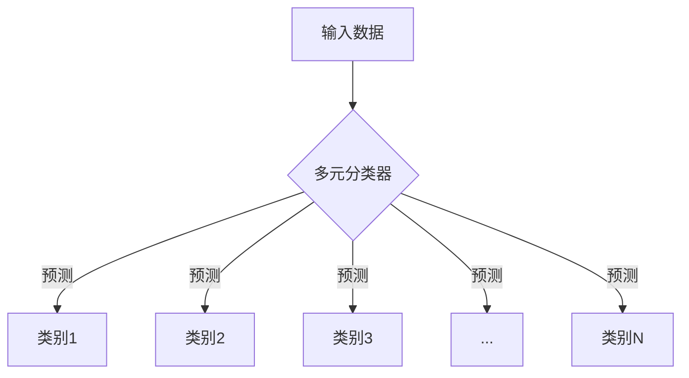

# 深度学习基础Day05

---

### 逻辑回归

**逻辑回归是用一条"S"形曲线（Sigmoid函数）将线性回归结果压缩到0-1之间，输出概率值的二分类算法。**为方便数学表达和计算，$y$的结果值取0或1。

#### 1、概念图解


#### 2、Sigmoid函数

$$
{\LARGE Sigm(x) = \frac{1}{1+e^{-x}}}
$$

Sigmoid函数的定义域为$(- \infty, \infty)$，值域为$(0, 1)$

我们可以将最终的输出当作$y=1$的概率$P(y=1,\vec{w}, \vec{x})$

#### 3、二元交叉熵损失(Log Loss)

$$
{\LARGE L(\vec{w}) = - \sum_{i=1}^{n}{\left [y^i \log_{}{sigm(\vec{x} \ \cdot \ \vec{w}) + (1 - y^i)\log{}{sigm(\vec{x} \ \cdot \ \vec{w})}} \right] }}
$$

在PyTorch中，交叉熵损失函数用`BCELoss()`表示

#### 4、与线性回归函数的比较

| 特性         | 线性回归         | 逻辑回归                |
| :----------- | :--------------- | :---------------------- |
| **输出**     | 连续值（如房价） | 概率值（0-1之间）       |
| **函数**     | 直线             | S形曲线（Sigmoid）      |
| **目标**     | 预测数值         | 预测类别概率            |
| **决策**     | 直接输出         | 设置阈值（通常0.5）分类 |
| **损失函数** | 均方误差（MSE）  | 交叉熵损失（Log Loss）  |

#### 5、应用

- 医疗诊断（患病概率预测）

- 金融风控（违约概率评估）

- 广告点击率（CTR）预估

- 垃圾邮件识别

- 客户流失预警

### 多元分类

多元分类（Multi-class Classification）是机器学习中的核心任务之一，指将输入数据分配到**三个或更多类别**中的一类。与二元分类（只有两个类别）不同，多元分类需要更复杂的模型和策略来处理多个类别的关系。



#### 1、softmax激活函数

$$
{\LARGE Softmax(x_i) = \frac{\exp(x_i)}{\sum_{j}^{}\exp(x_j)}}
$$

将原始分数转换为概率分布（所有输出和为1）

```python
# PyTorch实现Softmax回归
import torch.nn as nn

model = nn.Sequential(
    nn.Linear(input_size, 128),  # 输入层
    nn.ReLU(),
    nn.Linear(128, num_classes)  # 输出层=类别数
)
criterion = nn.CrossEntropyLoss()  # 包含Softmax的损失函数
```

要求输出层的神经元数目与所需分类的类别保持一致。

多元分类模型图


#### 2、交叉熵损失(Log Loss)

在PyTorch中使用`CrossEtropyLoss()`函数进行损失值的计算
$$
{\LARGE L(\vec{w}) = - \sum_{i=1}^{n}{\left [y^i \log_{}{sigm(\vec{x} \ \cdot \ \vec{w}) + (1 - y^i)\log{}{sigm(\vec{x} \ \cdot \ \vec{w})}} \right] }}
$$
