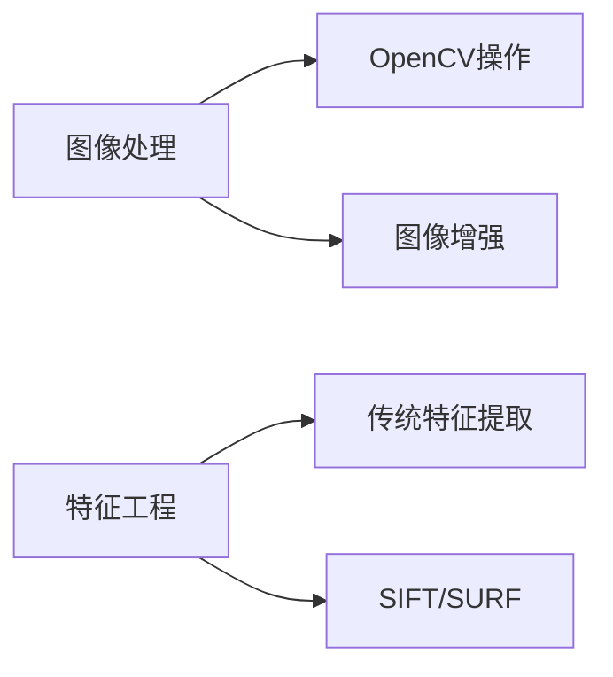
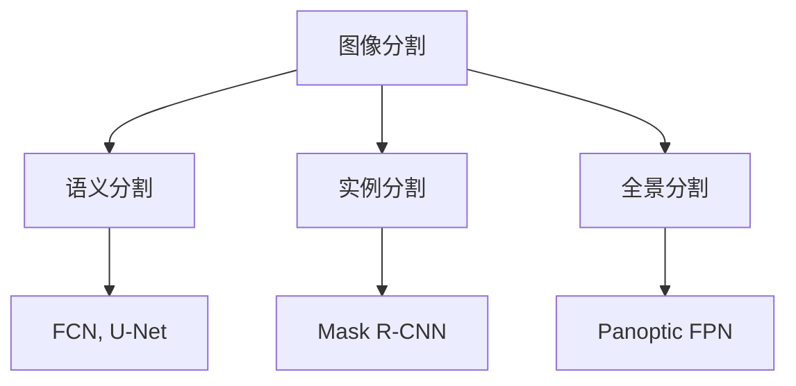
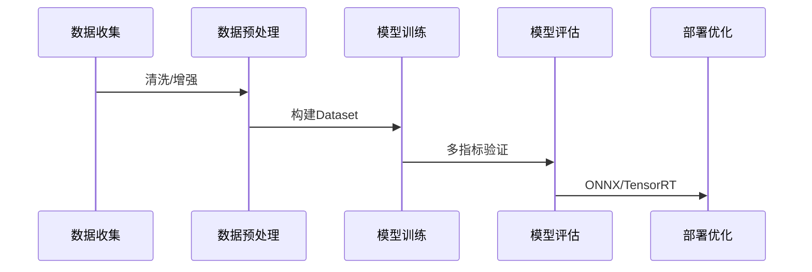

# 计算机视觉深度学习学习路线

## 基础准备阶段 (1-2个月)

### 数学基础
| 领域         | 关键内容               | 资源推荐             |
| ------------ | ---------------------- | -------------------- |
| **线性代数** | 矩阵运算、特征值分解   | 《线性代数及其应用》 |
| **微积分**   | 偏导数、梯度、链式法则 | 《微积分本质》系列   |
| **概率统计** | 概率分布、贝叶斯定理   | 《概率导论》         |

### 编程基础
```python
# 核心工具栈
import torch  # 深度学习框架
import torchvision  # 计算机视觉库
import matplotlib.pyplot as plt  # 可视化
import numpy as np  # 数值计算
import PIL  # 图像处理
```

### 机器学习基础
- 监督学习/非监督学习概念
- 过拟合与正则化
- 交叉验证
- 评估指标：准确率、精确率、召回率

## 核心技能阶段 (3-4个月)

### 深度学习基础
| 主题             | 关键内容                     | 实践项目             |
| ---------------- | ---------------------------- | -------------------- |
| **神经网络基础** | 全连接网络、反向传播         | MNIST手写数字识别    |
| **卷积神经网络** | 卷积层、池化层、经典架构     | CIFAR-10图像分类     |
| **PyTorch精通**  | Dataset/Dataloader、模型定义 | 自定义图像数据集加载 |

### 计算机视觉基础


## 核心模型阶段 (4-6个月)

### 图像分类
1. **经典CNN架构**
   - LeNet → AlexNet → VGG → GoogLeNet → ResNet
   - 实践：ImageNet子集分类

2. **迁移学习**
   ```python
   # PyTorch迁移学习示例
   model = torchvision.models.resnet50(pretrained=True)
   for param in model.parameters():
       param.requires_grad = False
   model.fc = nn.Linear(2048, num_classes)  # 修改最后一层
   ```

### 目标检测
| 模型类型        | 代表算法                        | 特点             |
| --------------- | ------------------------------- | ---------------- |
| **双阶段**      | R-CNN, Fast R-CNN, Faster R-CNN | 高精度、速度慢   |
| **单阶段**      | YOLO, SSD, RetinaNet            | 速度快、精度稍低 |
| **Anchor-Free** | CenterNet, FCOS                 | 无需预定义锚框   |

### 图像分割


### 关键应用
1. **人脸识别**
   - FaceNet, ArcFace
   - Triplet Loss实现
   
2. **姿态估计**
   - OpenPose, HRNet
   - 关键点检测

## 高级进阶 (2-3个月)

### 生成模型
| 模型类型     | 应用场景           | 代表算法           |
| ------------ | ------------------ | ------------------ |
| **GAN**      | 图像生成、风格迁移 | CycleGAN, StyleGAN |
| **扩散模型** | 高质量图像生成     | Stable Diffusion   |
| **VAE**      | 数据生成、特征学习 | VQ-VAE             |

### 视频理解
1. **时序模型**
   - 3D CNN, RNN, LSTM
2. **双流网络**
   - 空间流+时间流
3. **Transformer**
   - ViViT, TimeSformer

### 模型优化
```python
# 模型压缩技术
model = torch.quantization.quantize_dynamic(
    model, {nn.Linear}, dtype=torch.qint8
)
```

## 专业方向深化 (选择1-2个方向)

### 自动驾驶视觉
1. 车道线检测
2. 3D目标检测
3. 语义地图构建

### 医疗影像
1. 病灶分割
2. X光/CT分析
3. 病理图像识别

### 工业视觉
1. 缺陷检测
2. 产品分类
3. 质量管控

## 实践与提升 (持续进行)

### 项目开发流程


### 竞赛参与
1. Kaggle计算机视觉竞赛
2. CVPR/ICCV/ECCV挑战赛
3. 阿里天池/百度飞桨竞赛

### 开源贡献
1. PyTorch生态项目
2. MMDetection/MmSegmentation
3. Hugging Face Transformers

## 学习资源推荐

### 理论课程
- 斯坦福CS231n: Convolutional Neural Networks for Visual Recognition
- 李飞飞《视觉识别与深度学习》

### 实践平台
1. **Kaggle**: 真实数据集和竞赛
2. **Google Colab**: 免费GPU环境
3. **Papers With Code**: 最新论文+代码

### 书籍推荐
- 《深度学习》(花书)
- 《Python深度学习》(Keras之父)
- 《动手学深度学习》(PyTorch版)

## 工具链掌握

| 工具类型     | 推荐工具                   |
| ------------ | -------------------------- |
| **开发框架** | PyTorch, PyTorch Lightning |
| **可视化**   | TensorBoard, WandB         |
| **部署**     | ONNX, TensorRT, OpenVINO   |
| **数据标注** | LabelImg, CVAT, Scale AI   |

## 关键建议

1. **先动手后理论**：从实践项目反推理论学习
2. **复现论文**：选择经典论文完整复现
3. **模型调试技巧**：
   
   ```python
   # 学习率查找器
   from torch_lr_finder import LRFinder
   lr_finder = LRFinder(model, optimizer, criterion)
   lr_finder.range_test(train_loader, end_lr=10, num_iter=100)
   lr_finder.plot()
   ```
4. **保持更新**：关注CVPR/ICCV/ECCV最新论文
5. **构建作品集**：GitHub展示完整项目

这个学习路线需要约12-18个月的系统学习，重点在于理论与实践结合，通过项目驱动掌握核心技能。计算机视觉领域发展迅速，保持持续学习是关键。